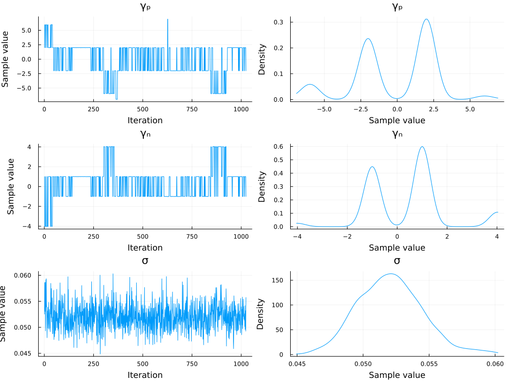

# Parameter Estimation

This brief tutorial explains how to performance Bayesian parameter estimation of the QPDM using [Pigeons.jl](https://github.com/Julia-Tempering/Pigeons.jl). One complication in estimating the parameters of the QPDM is that the posterior distributions may have multiple modes, which leads to convergence problems with most MCMC algorithms. Pigeons.jl uses a special type of parallel tempering to overcome this challenge. An additional advantage of using Pigeons.jl is the ability to compute Bayes factors from the log marginal likelihood using the function `stepping_stone`.

## Load Packages

First, we will load the required packages below. 

```julia
using Pigeons
using QuantumOrderEffectModels
using Random
using StatsPlots
using Turing
```

## Generate Simulated Data

The next step is to generate some simulated data from which the parameters can be estimated. In the code block below, the utility parameter $\mu_d$ is set to one and the entanglement parameter is set to $\gamma = 2$.  A total of 50 trials is generated for each of the three conditions. The resulting values represent the number of defections per condition out of 50.
```julia
Random.seed!(16)
Ψ = @. √([.35,.35,.15,.15])
parms = (Ψ, γₚ = 2.0, γₙ = .5, σ = .05)
n_trials = 100
model = QOEM(;parms...)
data = rand(model, n_trials)
```

## Define Turing Model

The next step is to define a Turing model with the `@model` macro. We will estimate the entanglement parameters using the prior $\gamma_j \sim \mathrm{normal}(0,3)$. The other parameters will be fixed to the data generating values defined in the code block above.

```julia 
@model function turing_model(data, parms)
    γₚ ~ Normal(0, 3)
    γₙ ~ Normal(0, 3)
    σ ~ LogNormal(-1, 1)
    data ~ QOEM(;parms..., γₚ, γₙ, σ)
end
```

## Estimate Parameters

To estimate the parameters, we need to pass the Turing model to `pigeons`. The second command converts the output to an `MCMCChain` object, which can be used for plotting
```julia
pt = pigeons(
    target=TuringLogPotential(turing_model(data, parms)), 
    record=[traces],
    multithreaded=true)
samples = Chains(sample_array(pt), ["γₚ", "γₙ","σ"])
```
The trace of the `pigeon`'s sampler is given below:
```julia
────────────────────────────────────────────────────────────────────────────
  scans        Λ      log(Z₁/Z₀)   min(α)     mean(α)    min(αₑ)   mean(αₑ) 
────────── ────────── ────────── ────────── ────────── ────────── ──────────
        2       3.92       -198          0      0.565      0.857      0.944 
        4       2.73        325   2.52e-08      0.696      0.973      0.997 
        8          4        363     0.0821      0.556          1          1 
       16       4.67        378    0.00235      0.481      0.993      0.999 
       32       4.61        385      0.131      0.488      0.997      0.999 
       64       5.21        386      0.277      0.422      0.998          1 
      128       5.11        386      0.334      0.433      0.999          1 
      256       5.09        386      0.337      0.435      0.997          1 
      512       5.11        386      0.365      0.432      0.998          1 
 1.02e+03       5.04        386      0.398       0.44      0.999          1 
```

## Plot Posterior Distribution 

Now we can plot the posterior distribution of $\gamma$ with `plot`. The posterior distribution of $\gamma$ has a primary mode around 1 and secondary modes around 2 and 3.5.
```julia 
plot(samples)
```

